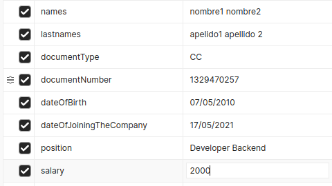

# pruebaParameta
Prueba de ingreso Parameta

## Requisitos
1. Motor DB Mysql instalado.
2. Maven en la maquina.
3. JDK 17.

## Instrucciones para compilar y ejecutar
1. Compile el proyecto para le generacion 
de clases Java SOAP con maven utilizando 'mvn compile'.
2. Para arrancar el proyecto ejecute 'mvn spring-boot:run'.

## NOTA:
* Las configuraciones a base de datos mysql se encuentran en el archivo properties
del proyecto en la raiz base/src/main/resources.

### Endpoint Rest
http://localhost:8080/api/employee

### Solicitud GET, QueryParams
* 